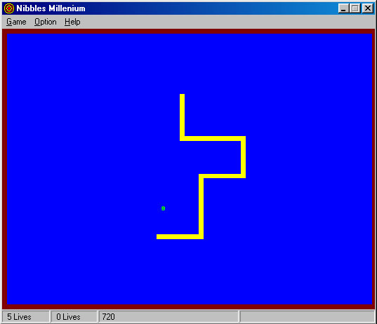



## a Nibbles Millenium

### Description

Relive the arcade, this game is an exact replica of the original "Nibbles" game that comes with Q-Basic. Featuring 2 player mode and 10 Level.

For more detail please visit my web site on http://www.medievilz.com
 
### More Info
 

             |
---                |---
**Submitted On**   |2000-09-06 18:30:14
**By**             |[James Salim](https://github.com/Planet-Source-Code/PSCIndex/blob/master/ByAuthor/james-salim.md)
**Level**          |Intermediate
**User Rating**    |4.7 (14 globes from 3 users)
**Compatibility**  |VB 6\.0
**Category**       |[Games](https://github.com/Planet-Source-Code/PSCIndex/blob/master/ByCategory/games__1-38.md)
**World**          |[Visual Basic](https://github.com/Planet-Source-Code/PSCIndex/blob/master/ByWorld/visual-basic.md)
**Archive File**   |[CODE\_UPLOAD9669962000\.zip](https://github.com/Planet-Source-Code/james-salim-a-nibbles-millenium__1-11289/archive/master.zip)

